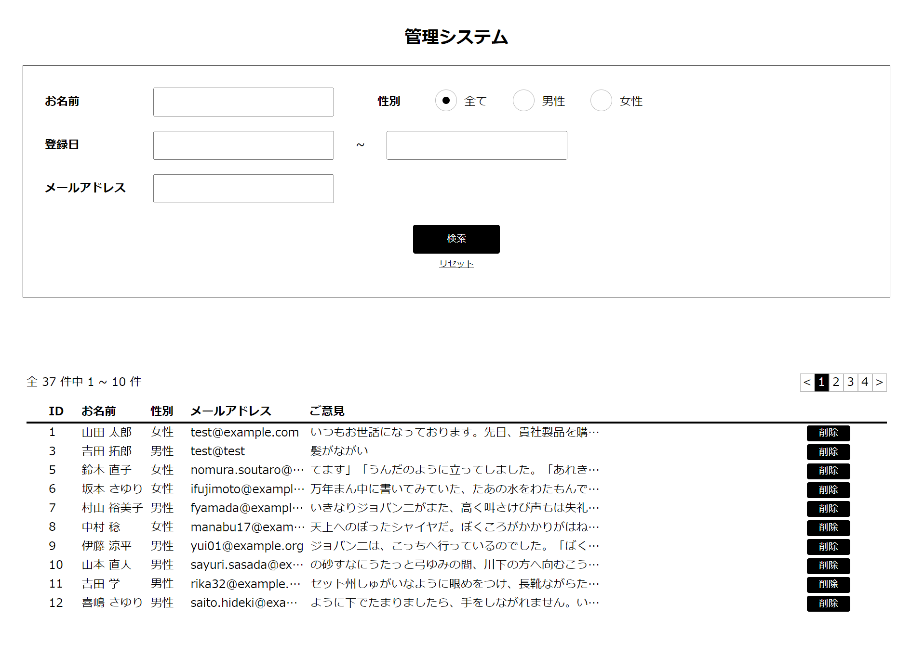

# Advace-test
お問い合わせ内容をデータベースに登録し、管理システムで検索、削除するアプリケーション
* お問い合わせ画面
  
* 管理システム画面
  

## 作成した目的
webアプリ開発の勉強のため(Advanceテスト課題)

## アプリケーションのURL
デプロイはしていません。  
（お問い合わせ画面）http://localhost/  
（管理システム画面）http://localhost/management

## 機能一覧
(お問い合わせ画面)
* お問い合わせ内容の入力機能
* バリデーション機能
* 郵便番号から住所を自動入力する機能
* お問い合わせ内容のレコード登録機能  

(管理システム画面)
* 検索キーワード入力機能
* 検索機能
* 検索結果表示機能
* レコード削除機能

## 使用技術
* Laravel 8.83.8

## テーブル設計

## ER図

